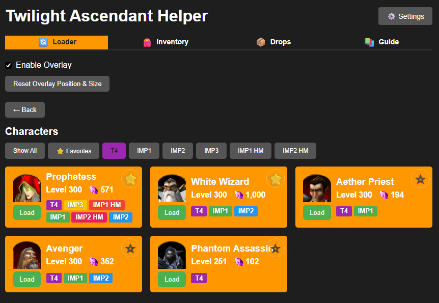
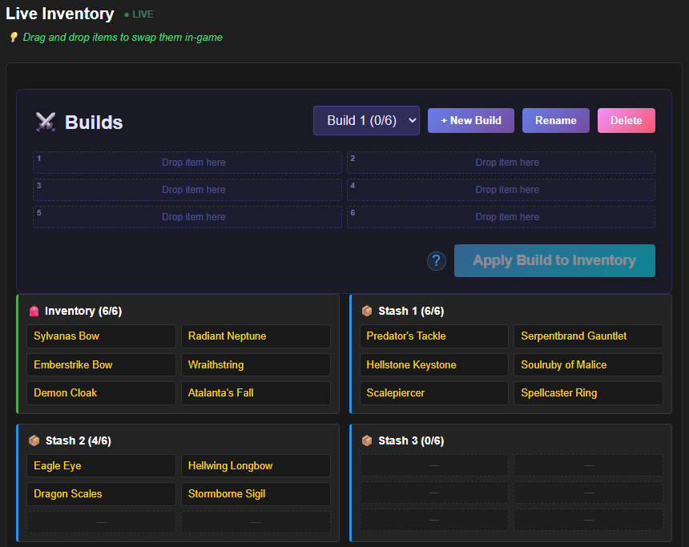
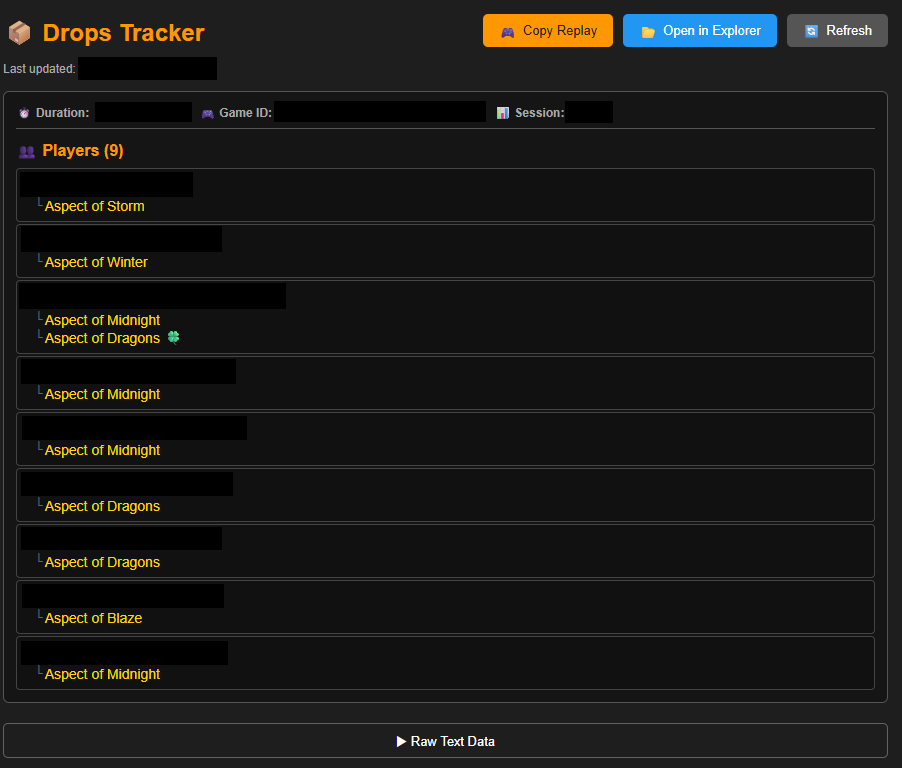
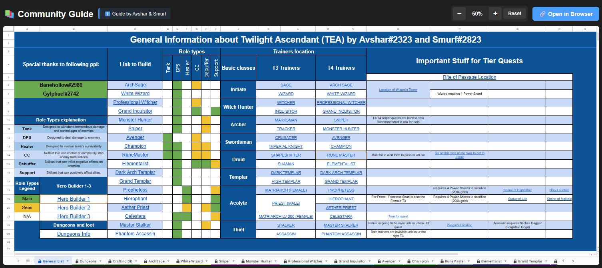
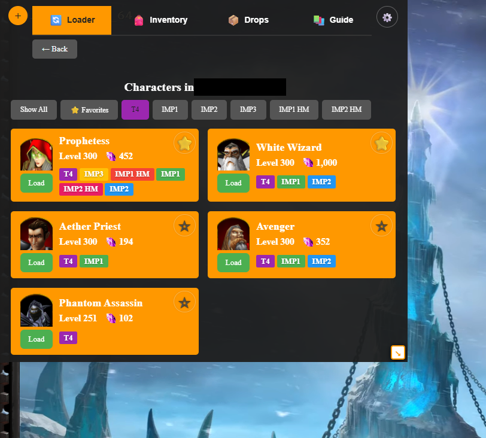
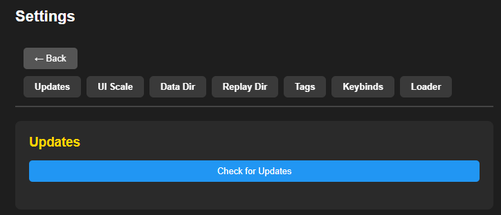

# Twilight Ascendant Helper

A desktop companion app for **Twilight Ascendant** - a Warcraft III custom RPG map. Manage your characters, track drops, optimize inventory, and enhance your gameplay experience.

---

## 🎮 Features

### 📦 Loader - Character Management

- **One-Click Loading**: Auto-load your character with a single button press
- **Character Cards**: Visual overview of all your heroes with their classes and levels
- **Quick Load**: Favorite your main characters for instant access
- **Tags & Filters**: Organize characters with custom tags and filter by class (T4 filter available)
- **Preload/Postload Messages**: Automatically send commands like `-rp`, `-noaa` before/after loading
- **Backup Support**: Load characters from backup files when needed
- **Formatted Class View**: Clean, organized display of character information

### 🎒 Inventory - Item Management

- **Live Inventory Tracking**: Real-time updates as you play (~0.25s refresh rate)
- **Drag & Drop Interface**: Intuitive item swapping with visual feedback
- **Smart Swap System**: Automatically generates optimal swap commands considering game mechanics
- **Build Management**: Save and apply custom item builds
  - Create multiple builds per character
  - Drag items from inventory/stashes to build slots
  - One-click build application
- **Formatted View**: See all 6 inventory slots and 6 stashes at a glance

### 💎 Drops - Loot Tracking

- **Real-Time Drop Tracking**: Monitor `drops.txt` for instant loot notifications
- **Formatted Display**: Clean view of all your recent drops
- **Replay Integration**: Automatically copy replay files to drops folder for easy Discord sharing
- **Last Replays**: Quick access to recent game replays

### 📖 Guide - Strategy Resources

- **Integrated Guides**: Built-in viewer for community guides
- **Google Sheets Integration**: View Avshar's and Smurf's comprehensive guides directly in the app
- **Always Updated**: Links to the latest community resources

### 🎯 Overlay - In-Game HUD

- **In-Game Overlay**: Display important information while playing
- **Customizable UI Scale**: Adjust overlay size to your preference
- **Character Card Scale**: Separate scaling for character cards
- **Minimize/Expand Keybind**: Quick toggle without leaving the game
- **Draggable**: Position overlay anywhere on screen
- **FPS Optimized**: Minimal performance impact
- **Click-Through**: Ignore mouse interactions when minimized

### ⚙️ Settings - Customization

- **Auto-Update**: Automatic updates in the background
- **UI Scaling**: Adjust main app, overlay, and character card sizes independently
- **Data Directory**: Change custom paths for game data (auto-detected by default)
- **Replay Directory**: Set custom replay folder location
- **Tags**: Create and manage custom tags for character organization
- **Keybinds**: Configure overlay minimize/expand hotkeys
- **Loader Settings**: Set preload/postload messages for automatic sending

---

## 📥 Installation

1. **Download** the latest release from [Releases](https://github.com/evamik/twilight-ascendant-helper/releases)
2. **Run** the installer (`Twilight-Ascendant-Helper-Setup-1.2.0.exe`)
3. **Launch** the app - it automatically detects your Warcraft III directory
4. **Start playing!** No setup needed unless you have a custom Warcraft III installation

---

## 🚀 Getting Started

### Loading a Character

1. Go to **Loader** tab
2. Select your character from the list
3. Click "Load Character" or use Quick Load for favorites
4. The load code is **automatically typed into Warcraft III** - no copy/paste needed!
5. Preload/postload messages (if configured) are sent automatically

### Managing Inventory

1. Go to **Inventory** tab while in-game
2. See live updates of your current items
3. Drag and drop items to swap them
4. Save builds for quick equipment changes

### Using the Overlay

1. Go to **Settings** → Enable "Show Overlay"
2. Configure overlay position and scale
3. Press your keybind (configurable) to minimize/expand while playing
4. Overlay shows character info without alt-tabbing

---

## 🔄 Updates

The app features **automatic updates** - you'll be notified when a new version is available and it will update in the background.

---

## 📋 System Requirements

- **OS**: Windows 10 or later
- **Game**: Warcraft III (Reforged or Classic)
- **Disk Space**: ~400MB
- **RAM**: Up to 200MB (varies based on features used)

---

## 📜 Changelog

### v1.2.0 (Latest)

- ✨ Guides tab with integrated Google Sheets viewer
- ✨ Item swapping with drag & drop interface
- ✨ Build management system

### v1.1.6

- Separate character card UI scaling

### v1.1.5

- Settings navbar redesign
- UI scaling settings
- Favorites filter
- Quickload fixes
- Overlay minimize/expand keybind

### v1.1.4

- Tags and filter system
- Hero cards summary with quick load
- Live file updates for drops.txt
- Loading from backups
- Items reformat

[View Full Changelog](https://github.com/evamik/twilight-ascendant-helper/releases)

---

## 👨‍💻 Developer

Created by **RagingCat**

**Happy adventuring in Twilight Ascendant!** 🌙✨
